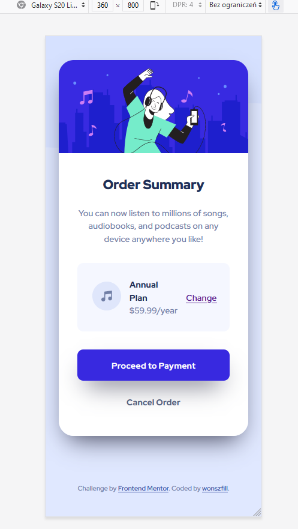

# Frontend Mentor - Order summary card solution

This is a solution to the [Order summary card challenge on Frontend Mentor](https://www.frontendmentor.io/challenges/order-summary-component-QlPmajDUj). Frontend Mentor challenges help you improve your coding skills by building realistic projects. 

## Table of contents

- [Overview](#overview)
  - [The challenge](#the-challenge)
  - [Screenshot](#screenshot)
  - [Links](#links)
- [My process](#my-process)
  - [Built with](#built-with)
  - [What I learned](#what-i-learned)
- [Author](#author)
- [Acknowledgments](#acknowledgments)

## Overview

### The challenge

Users should be able to:

- See hover states for interactive elements

### Screenshot



### Links

- Solution URL: [Github repo](https://github.com/wonszfill/Order_summary_Frontend_Mentor)

## My process

### Built with

- Semantic HTML5 markup
- CSS custom properties
- Flexbox
- Mobile-first workflow

### What I learned

I had to recall basics of transitions and css inheritance, i.e. :

```css
.card-plan div a {
    transition: opacity .15s ease-in-out;
}
```

## Author

- Website - [Przemek Wojszwiłło](https://github.com/wonszfill)
- Frontend Mentor - [@wonszfill](https://www.frontendmentor.io/profile/wonszfill)


## Acknowledgments

Great thanks to stackoverflow community and frontend mentor for creating the challenge.

